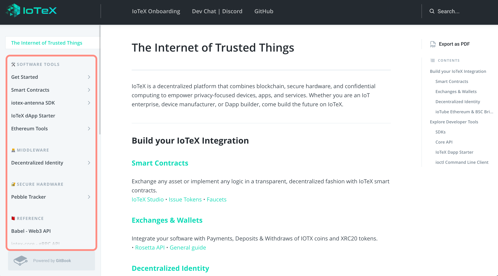

# IoTeX Documentation Bounty

| Author          | Date           | Version  |
| :-------------: | :------------: | :------: |
| [@mwood77](https://github.com/mwood77) |  24 May, 2021  |  0.0.1   |

| Customer        | Source           |
| :-------------: | :-------------:  | 
| [@simonerom](https://github.com/simonerom) | [Review And Improve IoTeX Docs](https://gitcoin.co/issue/iotexproject/halogrants/32/100025753) |

# Project Brief
We would like you to go through our documentation website at [https://docs.iotex.io](https://docs.iotex.io) from a `User/Developer` perspective and provide a report pointing out errors, inconsistencies, typos, dead links. Also go through the examples and tutorials and try them reporting what is not working, errors, outdated content etc...

## Acceptance criteria
- Read carefully through every single section and try out all instructions to make sure there is no confusing content.
- Report as many issues as possible in your report
- If you have any, please report any suggestions about how you would improve the content

## Milestone 1
- Provide a report with the list of relevant things to change/improve: for each item provide at least
    - a screenshot of the relevant doc section
    - the actual link to get there
    - your notes about what's wrong/how to improve

# The Process
## Introduction
The following document(s) encompass a thorough review of IoTeX's devloper documentation. These resources are available at the following, and valid as of the date mentioned in this project's [header](#iotex-documentation-bounty):
- Published site: [https://docs.iotex.io/](https://docs.iotex.io/)
- Docs source: [github: iotex-docs](https://github.com/iotexproject/iotex-docs)
- Onboarding site: [https://onboard.iotex.io/](https://onboard.iotex.io/)

Tools used by the project:
- [Vuepress](https://vuepress.vuejs.org/config/)
- [GitBook](https://docs.gitbook.com/)
- [Github workflows](https://github.com/iotexproject/iotex-docs/blob/master/.github/workflows/deploy.yml)

The reviewer has followed a top-down approach. That means that the pages are reviewed in the order in which they are displayed on the website's Table of Contents (red outline):
    - 

## Reviewer Background
I am a full time software engineer, working in the finance industry. Primarily working in microservice, cloud, and event based backend development. Primary develoment languages are Java and TypeScript.

## Method
Each page was observed for the following issues:
1. **Textual**
    - Issues that include grammatical errors, typos, confusing sentences, general written content feedback, etc
1. **Media**
    - Issues to do with images and videos (not hyperlinked).
1. **Hyperlink**
    - Issues to do with broken links, out of date links, unlinked pages, etc.
1. **Examples**
    - Issues to do with code blocks, example applications, etc.
1. **Other**
    -  Anything that does not fall within the above categories.

In the [Report Findings](#report-findings) section, you'll find pages which contain a table of relevant issues. If a page is omitted in the Report Findings section, you may assume that the reviewer could not find a fault in it.

# Report Findings
> @todo - ⚠️ the review is still ongoing. 

## Summary Findings
| Textual Findings  | Media Findings   | Hyperlink Findings  | Example Findings  |  Other  |
| :-------------: | :------------: | :------: |   :------: |  :------: |
| 0               |  0             |  0       |    0       |   0       |

### Reviewer Recommendations
> @todo - ⚠️ the review is still ongoing, therefore no recommendations yet

## General Findings
1. Lack of Versioning
    - The documentation does not appear to be versioned or tagged in the repository. This would add significant value, internally and externally, as it would tightly couple your documentation to your code. A fantastic example of this is [Google's Angular documentation](https://angular.io/docs), which not only is tied to release candidates, but also signifacntly changes the site's styling depending if the version selected is current, past, or a future RC.
1. 

## Page Findings

@todo - check repo mappings (iotex -> review links)

### `landing page`(https://docs.iotex.io/)
- [Landing Page (Index)](./pages/index.md)

### [`/software-tools/`]()
- [Getting Started (Software Tools)](./pages/software-tools/getting-started.md)
- [Install iocl cli](./pages/software-tools/getting-started.md)