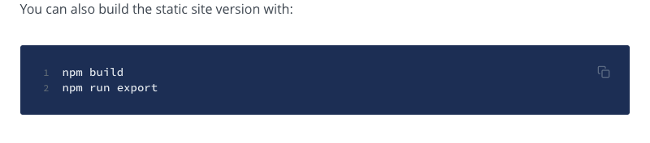

## IoTex dApp Starter
| Page        | Link           |
| :-------------: | :-------------:  | 
| IoTex dApp Starter | https://docs.iotex.io/software-tools/iotex-dapp-starter |

## Issues
| #   | Fault Category | Reviewer Comments | Evidence |
| :--: | :--: | :--: | :--: |
| 19001 | Examples | Using the "Get Started" codeblock in install `iotex-dapp-sample` showed install errors. | Raised issue: @todo - raise issue on github |
| 19002 | Examples | Codeblock has incorrect command. `npm build` should be `npm run build` |  |