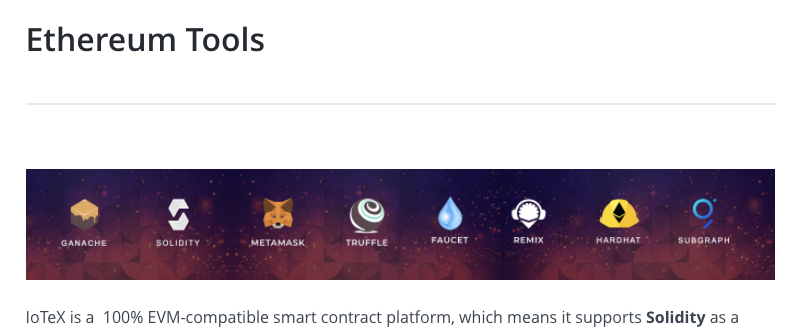

## Ethereum Tools
| Page        | Link           |
| :-------------: | :-------------:  | 
| Ethereum Tools | https://docs.iotex.io/software-tools/ethereum-tools |

## Issues
| #   | Fault Category | Reviewer Comments | Evidence |
| :--: | :--: | :--: | :--: |
| 20001 | Textual | Doulbe " " character. | "IoTeX is a`__`100% EVM-compatible smart contract..." |
| 20002 | Media | Image does not have alternate text available for accesibility. |  |
| 20003 | Textual | Doulbe " " character. | "...programming language,  allowing for any`__`Ethereum dApps to be..." |
| 20003 | Hyperlink | "Ethereum" links to italian language site. should direct to domain's slug URL instead. | Link: https://ethereum.org/it/ |