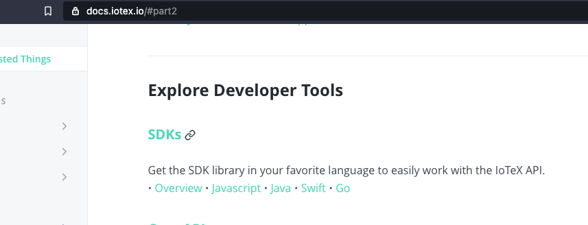
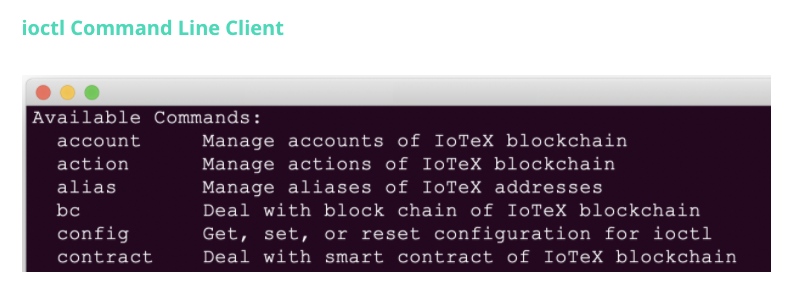

## Landing Page
| Page        | Link           |
| :-------------: | :-------------:  | 
| Index     | https://docs.iotex.io/ |

## Issues
| #   | Fault Category | Reviewer Comments | Evidence |
| :--: | :--: | :--: | :--: |
| 1001 |  Hyperlink | Clicking the "Explore Developer Tools" anchor in the contents does not match the page anchor expected name; "part2" |  |
| 1002 |  Text | The description sentence for for "Exchanges & Wallets" is somewhat awkward. Consider rephrasing. | `Integrate your software with Payments, Deposits & Withdraws of IOTX coins and XRC20 tokens.` |
| 1003 |  Text | Copy is not on brand/consistant with the rest of the text on the page (use of exclamation mark). | `Give your users the ability to create and control their identity. IoTeX DID applies to individuals, enterprises and devices!` |
| 1004 |  Text | Consider explaining what "IoTeX DID" is. | `...IoTeX DID applies to...` => `...IoTeX DID (Decentralized Identity) applies to...` |
| 1005 |  Hyperlink | The "Overview" hyperlink under Decentralized Identity is broken. | https://docs.iotex.io/#decentralized-identity ==> https://docs.iotex.io/developer/did/overview |
| 1006 |  Hyperlink | The "ioctl commands" hyperlink under Decentralized Identity is broken. | https://docs.iotex.io/#decentralized-identity ==> https://docs.iotex.io/developer/ioctl/did |
 1007 |  Text | Grammatical error - missing a `.` for "ioTube Etherum & BSC Bridge" | `Extend the reach of your ERC20 or BEP20 Token to the IoTeX Blockchain to run transactions-intensive tasks` |
 1008 |  Text | "SDKs" should have "Embedded (C)" added to the available API list as it's linked in the SDK's Overview page ; "JavaScript, Java, Swift, Go, Emedded (C)." | Link: https://docs.iotex.io/software-tools/iotex-antenna-sdk/antenna-installation/antenna-embedded|
| 1009 |  Text | Use of word "dApp" is inconsistant; title uses "Dapp" and sentence beneath uses "dApp."  | `"IoTeX Dapp Starter"...."with our dApp sample"...` |
| 1010 |  Hyperlink | "IoTeX Dapp Starter" anchor link and "Overview" hyperlink point to the same page: https://docs.iotex.io/software-tools/iotex-dapp-starter | https://docs.iotex.io/#iotex-dapp-starter |
| 1011 |  Media | Accessibility - Image does not have alternative text available |   |