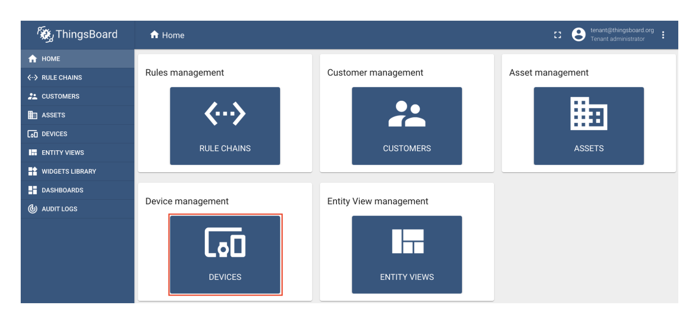

## Quick Start
| Page        | Link           |
| :-------------: | :-------------:  | 
| Quick Start | https://docs.iotex.io/secure-hardware/pebble-tracker/quick-start |

## Issues
| #   | Fault Category | Reviewer Comments | Evidence |
| :--: | :--: | :--: | :--: |
| 32001 | Media | All images on this page do not have alternative/accessibility text |  |
| 32002 | Textual | Grammatical error; missing word "you." | "Before `you` start using your Pebble..." |
| 32003 | Hyperlink | Broken link: "trypebble.io" | Link: https://trypebble.io/ |
| 32004 | Textual | Recommendation: "http://trypebble.io:8080/login" should be in monospace. | "To setup your dashboard, you can login into Thingsboard at http://trypebble.io:8080/login using the following credentials:" |
| 32005 | Textual | Recommendation: warning message should be a callout. | "Please Note that the login credentials are shared by all Pebble users, so please do not change them!" |