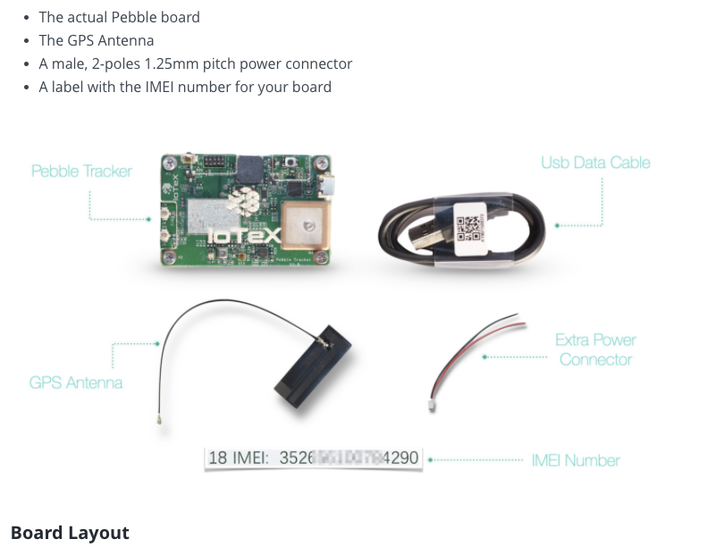

## Hardware Setup
| Page        | Link           |
| :-------------: | :-------------:  | 
| Hardware Setup | https://docs.iotex.io/secure-hardware/pebble-tracker/hardware-setup |

## Issues
| #   | Fault Category | Reviewer Comments | Evidence |
| :--: | :--: | :--: | :--: |
| 34001 | Media | All images on this page do not have alternative/accessibility text |  |
| 34002 | Textual | "TODO" found in text. | "Reset button: This is a small switch button that allows to reset the board software (short press) or to put the board in recovery mode (see [TODO: Flashing the firmware])." |
| 34003 | Textual | Grammatical: change "a" to "an" | "Insert `a` IoT Micro-SIM into the Pebble SIM card slot until it's locked inside..." |
| 34004 | Hyperlink | Broken link: "AT&T IoT Data Plan SIM" | Link: https://marketplace.att.com/products/att-iot-dataplans-lte-internationalloc |
