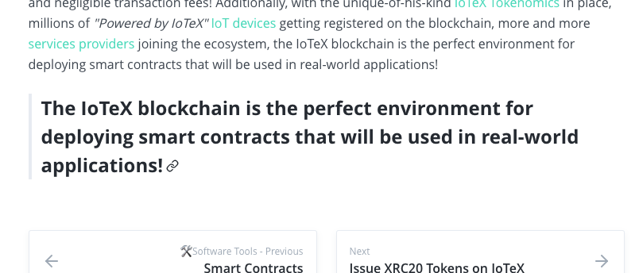

## Introduction
| Page        | Link           |
| :-------------: | :-------------:  | 
| Introduction | https://docs.iotex.io/software-tools/smart-contracts/introduction|

## Issues
| #   | Fault Category | Reviewer Comments | Evidence |
| :--: | :--: | :--: | :--: |
| 7001 | Hyperlink | Anchor "Advantages of IoTeX Smart Contracts" does not align with anchor point `.../smart-contracts/introduction#smart-contracts-iotex-vs-ethereum` | https://docs.iotex.io/software-tools/smart-contracts/introduction#smart-contracts-iotex-vs-ethereum |
| 7002 | Textual | Missing space " " character beween the end of the hyperlink, "window)", and word, "that".|  "Mastering Ethereum: Building Smart Contracts and DApps - 1st Edition (opens new window)that is freely readable" |
| 7003 | Textual | Run on sentence |  "Besides IoTeX smart contracts being fully compatible with Ethereum ones, developing your contracts on the IoTeX blockchain brings some additional benefits: IoTeX is designed to be an IoT-Friendly platform, where the blockchain is the orchestrating layer for devices coordination and end-to-end trusted data transfers." |
| 7004 | Hyperlink | Broken link "services providers" | https://docs.ipfs.io/concepts/case-study-iotex/ |
| 7005 | Textual | Callout looks out of place at the bottom of the page - suggest that this be moved to the top or removed |  |