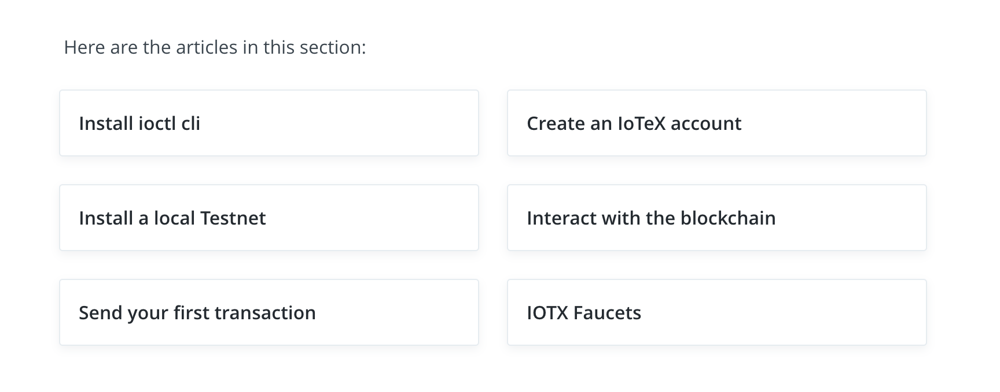

## Getting Started
| Page        | Link           |
| :-------------: | :-------------:  | 
| Getting Started      | https://docs.iotex.io/software-tools/get-started  |

## Issues
| #  | Fault Category | Reviewer Comments | Evidence |
| :--: | :--: | :--: | :--: |
| 2001 |  Textual |  User is missing context. It is difficult to decide which option to click on, without clicking on each item. |  |
