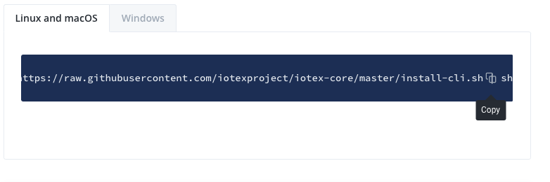

## Install ioctl cli
| Page        | Link           |
| :-------------: | :-------------:  | 
| Install ioctl cli  | https://docs.iotex.io/software-tools/get-started/install-ioctl-cli |

## Issues
| #  | Fault Category | Reviewer Comments | Evidence |
| :--: | :--: | :--: | :--: |
| 3001 | Hyperlink | The "gateway" hyperlink is broken; returns a 404. | https://docs.iotex.io/introduction/node-concept |
| 3002 | Hyperlink | The "actions" hyperlink is broken; returns a 404. | https://docs.iotex.io/introduction/action-concept |
| 3003 | Examples | The copy button in codeblocks is difficult to see/use. |  |
