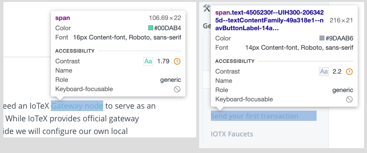

# IoTeX Documentation Bounty

| Author          | Date           | Version  |
| :-------------: | :------------: | :------: |
| [@mwood77](https://github.com/mwood77) |  27 May, 2021  |  1.0.0   |

| Customer        | Source           |
| :-------------: | :-------------:  | 
| [@simonerom](https://github.com/simonerom) | [Review And Improve IoTeX Docs](https://gitcoin.co/issue/iotexproject/halogrants/32/100025753) |

# Report Findings
> If a page is omitted in the Report Findings section, you may assume that the reviewer could not find a fault in it.

## Summary Findings
| Textual Findings  | Media Findings   | Hyperlink Findings  | Example Findings  |  Other  |
| :-------------: | :------------: | :------: |   :------: |  :------: |
| 90              |  10            |  72      |    6       |   0       |

# Reviewer Recommendations

## General Findings
1. Lack of Versioning
    - The documentation does not appear to be versioned. This would add significant value, internally and externally, as it would tightly couple your documentation to your code. A fantastic example of this is [Google's Angular documentation](https://angular.io/docs), which not only is tied to release candidates, but also signifacntly changes the site's styling depending if the version selected is current, past, or a future RC.
    - This would also facilitate language translations, and the managing thereof.
1. Accessibility
    - Attention to accessibility features must be increased. There are a lack of accessibility-first styling choices that can easily be rectified.
    - This includes:
        - A majority of images do not contain sub-headings or alternative text
        - Submenu headings are not keyboard focusable
        - Submenu text colour change - contrast is very low.
            - Google's Material library has excellent documentation and tools to assist in building highly legible/accesible colour palletes
            - [Colour and Accessibilty tool](https://material.io/resources/color/#!/?view.left=1&view.right=0&primary.color=6002ee)
            - [General colour advise](https://material.io/design/color/the-color-system.html#color-theme-creation)
         
1. Lack of community engagement. Community engagement is an important part of community buy-in. Allowing users to edit your documentation, in a controlled manner, would add significant community buy-in. This would also reduce the overall time spent by the development/IoTeX team reviewing their own documentation.
1. **Stretch Goal** - The reviewer recommends migrating to a different platform to handle documentation. One that specifically offers versioning, opensource contribution, and is highly customizable.
    - Recommendation: [Docusaurus](https://docusaurus.io/)
        - Allows for community contributions (documentation can be forked, edited, and PRs raised to migrate into main / published docs)
        - Accessibility focused
        - Incorporates document versioning
        - Allows for out-of-the-box translations (community driven)
        - Uses Markdown formatting, which should enable a re-use of existing documentation
        - Built on React, which IoTeX teammembers appear to be familiar with
        - Highly customizable

# Page Findings

#### `landing Page & Uncategorized`
- [Landing Page (Index)](./pages/1000-index.md)
- [IoTex dApp Starter](./pages/19000-iotex-dapp-starter.md)
- [Babel - Web3 API](./pages/40000-babel-web3-api.md)
- [Analytics GraphQL API](./pages/41000-analytics-graphql-api.md)
- [Action Injector](./pages/49000-action-injector.md)
- [Blockchain Nodes](./pages/52000-blockchain-nodes.md)
- [Accounts Cryptography](./pages/53000-accounts-cryptography.md)

#### `Get Started`
- [Getting Started (Software Tools)](./pages/software-tools/2000-getting-started.md)
- [Install iocl cli](./pages/software-tools/3000-install-ioctl-cli.md)
- [Create an IoTeX account](./pages/software-tools/4000-create-an-iotex-account.md)
- [Install a local Testnet](./pages/software-tools/5000-install-a-local-testnet.md)
- [Interact with the blockchain](./pages/software-tools/6000-interact-with-the-blockchain.md)

#### `Smart Contracts`
- [Introduction](./pages/smart-contracts/7000-introduction.md)
- [Issue XRC20 Tokens on IoTeX](./pages/smart-contracts/8000-issue-xrc20-tokens-on-iotex.md)
- [Token Metadata](./pages/smart-contracts/9000-token-metadata.md)

#### `Iotex-antenna SDK`
- [Overview](./pages/iotex-antenna-sdk/10000-overview.md)
- [Antenna JS](./pages/iotex-antenna-sdk/11000-antenna-js.md)
- [Antenna Go](./pages/iotex-antenna-sdk/12000-antenna-go.md)
- [Antenna Swift](./pages/iotex-antenna-sdk/13000-antenna-swift.md)
- [Antenna Embedded](./pages/iotex-antenna-sdk/14000-antenna-embedded.md)
- [Create an Account](./pages/iotex-antenna-sdk/15000-create-an-account.md)
- [Make Token Transfers](./pages/iotex-antenna-sdk/16000-make-token-transfers.md)
- [Interact With Smart Contracts](./pages/iotex-antenna-sdk/17000-interact-with-smart-contracts.md)
- [Examples](./pages/iotex-antenna-sdk/18000-examples.md)

#### `Ethereum Tools`
- [Ethereum Tools](./pages/ethereum-tools/20000-ethereum-tools.md)
- [Metamask](./pages/ethereum-tools/21000-metamask.md)
- [Web3.js](./pages/ethereum-tools/22000-web3js.md)
- [Remix](./pages/ethereum-tools/23000-remix.md)

#### `Decentralized Identity`
- [Overview](./pages/decentralized-identity/24000-overview.md)
- [Self-Managed Contract Interface](./pages/decentralized-identity/25000-self-managed-contract-interface.md)
- [Create/Register a IoTeX DID](./pages/decentralized-identity/26000-create-register-a-iotex-did.md)
- [Query a IoTeX DID](./pages/decentralized-identity/27000-query-a-iotex-did.md)
- [Update a IoTeX DID](./pages/decentralized-identity/28000-update-a-iotex-did.md)
- [Delete a IoTeX DID](./pages/decentralized-identity/29000-delete-a-iotex-did.md)
- [Resolve a IoTeX DID Document](./pages/decentralized-identity/30000-resolve-a-iotex-did-document.md)
- [Security Considerations](./pages/decentralized-identity/31000-security-considerations.md)

#### `Pebble Tracker`
- [Quick Start](./pages/pebble-tracker/32000-quick-start.md)
- [Technical Specification](./pages/pebble-tracker/33000-technical-specification.md)
- [Hardware Setup](./pages/pebble-tracker/34000-hardware-setup.md)
- [Deploy the backend service](./pages/pebble-tracker/35000-deploy-the-backend-service.md)
- [Send data to the backend](./pages/pebble-tracker/36000-send-data-to-the-backend.md)
- [Build on Windows](./pages/pebble-tracker/37000-build-on-windows.md)
- [Build on Linux/macOS](./pages/pebble-tracker/38000-build-on-linux-macos.md)
- [Configure the firmware](./pages/pebble-tracker/39000-configure-the-firmware.md)

#### `ioctl cli - Reference`
- [HD Wallet Account](./pages/ioctl-cli-reference/42000-hd-wallet-account.md)
- [Smart Contracts](./pages/ioctl-cli-reference/43000-smart-contracts.md)
- [Decentralized Identity](./pages/ioctl-cli-reference/44000-decentralized-identity.md)
- [JWT Tokens](./pages/ioctl-cli-reference/45000-jwt-tokens.md)

#### `Clone Existing Projects`
- [Rolling Dice](./pages/clone-existing-projects/46000-rolling-dice.md)

#### `Exchange Integration`
- [General Guide](./pages/exchange-integration/47000-general-guide.md)
- [Rosetta API](./pages/exchange-integration/48000-rosetta-api.md)

#### `Rewards Distribution`
- [Analytics Bookkeeping](./pages/rewards-distribution/50000-analytics-bookkeeping.md)

#### `Accounts`
- [Owned Accounts](./pages/accounts/51000-owned-accounts.md)
